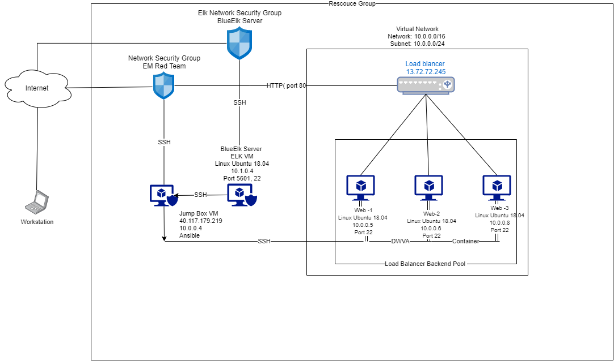

## Automated ELK Stack Deployment

The files in this repository were used to configure the network depicted below.

These files have been tested and used to generate a live ELK deployment on Azure. They can be used to either recreate the entire deployment pictured above. Alternatively, select portions of the playbook file may be used to install only certain pieces of it, such as Filebeat.

  - ![Filebeat-playbook.yml (C:\Users\Edward\Documents\Cybersecurity-Project-1\Ansible\filebeat-playbook.yml.txt)

This document contains the following details:
- Description of the Topologu
- Access Policies
- ELK Configuration
  - Beats in Use
  - Machines Being Monitored
- How to Use the Ansible Build

### Description of the Topology

The main purpose of this network is to expose a load-balanced and monitored instance of DVWA, the D*mn Vulnerable Web Application.
Load balancing ensures that the application will be highly available, in addition to restricting access to the network.  Load Balancer protects the servers from denial-of-service attack by distributing the traffic among the servers.  One benefit of using a jump box is that it protects the virtual machines in the network from public exposure. Integrating an ELK server allows users to easily monitor the vulnerable VMs for changes to the log files and system performance, via Firebeat and Metricbeat.
The configuration details of each machine may be found below.

The configuration details of each machine may be found below.
_Note: Use the [Markdown Table Generator](http://www.tablesgenerator.com/markdown_tables) to add/remove values from the table_.

| Name     | Function | IP Address | Operating System |
|----------|----------|------------|------------------|
| Jump Box | Gateway  | 10.0.0.4   | Linux Ubuntu 18.04         |
| Web-1     |  VM        |  10.0.0.5          |  Linux Ubuntu 18.04                |
| Web-2   |   VM       |   10.0.0.6         |       Linux Ubuntu 18.04           |
| Web-3  |       VM   |    10.0.0.8        |      Linux Ubuntu 18.04            |
|BlueElkServer |ELK |10.1.0.4| 10.1.0.4
### Access Policies

The machines on the internal network are not exposed to the public Internet. 

Only the  Jumpbox machine can accept connections from the Internet. Access to this machine is only allowed from the following IP addresses:
- 	40.117.179.219

Machines within the network can only be accessed by Port 22.
- 	10.0.0.4 can access your ELK VM

A summary of the access policies in place can be found in the table below.

| Name     | Publicly Accessible | Allowed IP Addresses |
|----------|---------------------|----------------------|
| EM JumpBox|	Yes	|10.0.0.4/40.117.179.219  |
|        Web-1  |   NO                  |   10.0.0.5    |
|      Web 2   |  NO              |       10.0.0.6               |
|Web-3| NO| 10.0.0.8 |
|BlueElkServer| NO| 10.1.0.4|
### Elk Configuration

Ansible was used to automate configuration of the ELK machine. No configuration was performed manually, which is advantageous because reduced the daily workload on IT Administrator and enables him or her to focus on other needs of the business line.

The playbook implements the following tasks:
- Configure Elk VM with Docker
- Install docker.io
- Install pip3
- Download and launch a docker elk container

The following screenshot displays the result of running `docker ps` after successfully configuring the ELK instance.

### Target Machines & Beats
This ELK server is configured to monitor the following machines:
|Name 	 |IP Addresses|
|Web 1	|10.0.0.5|
|Web 2	|10.0.0.6|
|Web 3| 10.0.0.8|

We have installed the following Beats on these machines:
- Filebeat and Metricbeat

These Beats allow us to collect the following information from each machine:
- Filebeat collects data about the file system, which files have changed and when they changed.
- Metricbeat collects machine metrics, such as uptime.

### Using the Playbook
In order to use the playbook, you will need to have an Ansible control node already configured. Assuming you have such a control node provisioned: 

SSH into the control node and follow the steps below:
- Copy the YAML file to /etc/ansible
- Update the /etc/ansible file to include ansible_python_interpreter=/usr/bin/python3
- Run the playbook, and navigate to curl localhost/setup.php to check that the installation worked as expected.

_TODO: Answer the following questions to fill in the blanks:_
- The playbooks are pentest.yml; project1v1.yml; filebeat-playbook.yml ; metricbeat-playbook.yml  are stored in the /etc/ansible directory.
- Update the /etc/ansible/hosts file to make Ansible run the playbook on a specific machine,. Within this file, name groups using square brackets (currently contains '[webservers]' and '[elk]') surrounding the group-name and under the group-name, replace private IP's with your own respective IP's. You then use these group-names behind the "hosts:" field in the playbooks to specify which machines to apply the playbook to.

- To check if the ELK server is running, navigate to http://[your.VM.IP]:5601/app/kibana

- _Which URL do you navigate to in order to check that the ELK server is running?

_As a **Bonus**, provide the specific commands the user will need to run to download the playbook, update the files, etc._